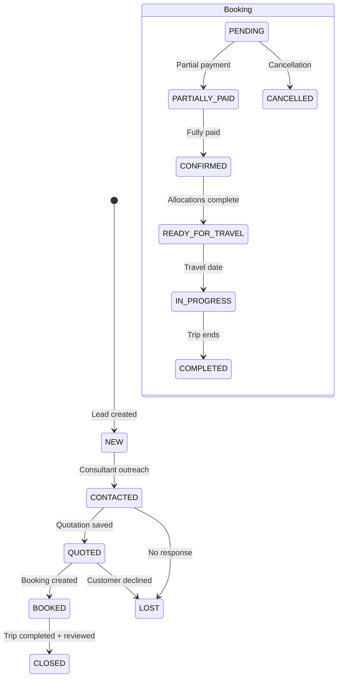

# Moksh Yatri V1 — Business Logic Audit 001

**Audit Date:** June 8, 2026  
**Scope:** End-to-end travel operations workflow (V1 codebase)  
**Assumed canonical workflow:**

```
Lead → Quotation → Booking → Hotel Allocation → Vehicle Allocation
     → Payment → Ready To Travel → Trip → Review
```

**Documents reviewed:** `frontend/CLAUDE.md`, `docs/architecture/SYSTEM_OVERVIEW.md`, `docs/database/DATABASE_SCHEMA.md`, `docs/product/V2_ROADMAP.md`

**Code focus:** `leadService`, `quotationService`, `bookingService`, `paymentService`, `hotelAllocationService`, `vehicleAllocationService`, `pricingEngineService`, `timelineService`, `reviewService`, and related admin/customer pages.

---

## Executive Summary

Moksh Yatri V1 implements the full travel sales and operations pipeline in code, but **business rules are inconsistently enforced across entry points**. The same outcome (e.g. creating a booking) can be reached through paths with different validations, and several automated status transitions only fire from specific screens.

**Highest business risk areas:**

1. **Dual booking creation paths** — quotation conversion enforces duplicate protection and lead linkage; the admin Bookings page does not.
2. **Payment and readiness logic** — advance payments, installment payments, and `balance_due` can disagree; trip-ready checks differ between admin, customer, and payment automation.
3. **Allocations disconnected from quotations** — hotels and vehicles can be assigned without validating package, destination, dates, or capacity.
4. **Reviews gated on “trip ready” instead of “trip completed”** — customers can review before travel occurs.
5. **Lead data model split** — website leads and admin leads capture destination differently, breaking downstream quoting consistency.

**Overall verdict:** The workflow is **operationally usable for a small team that manually compensates in process**, but it is **not yet business-safe at scale** without centralized transition rules and validation at the service layer.

---

## Workflow Coverage Map

| Stage | Implemented | Auto-validated | Gaps |
|-------|-------------|----------------|------|
| Lead | ✅ | ❌ | No required-field rules; split destination model |
| Quotation | ✅ | Partial | Pricing can under-quote; multiple quotes per lead |
| Booking | ✅ | Partial | Two creation paths with different rules |
| Hotel allocation | ✅ | ❌ | No date/location/capacity checks |
| Vehicle allocation | ✅ | ❌ | No capacity/category checks |
| Payment | ✅ | Partial | Overpayment; advance double-count risk in displays |
| Ready to travel | Partial | Partial | Manual status override; allocation doesn't update status |
| Trip (in progress / completed) | Partial | ❌ | Statuses exist but no date-driven automation |
| Review | ✅ | ❌ | Wrong lifecycle gate; no trip-completion check |

---

## 1. Missing Business Validations

### BL-001 — No validation on lead creation fields

**Description:** `createLead()` accepts any payload with no checks for required customer identity, phone format, minimum travelers, positive budget, or future travel month.

**Risk:** Operations receives incomplete or nonsensical inquiries that cannot be quoted or contacted reliably.

**Example scenario:** A lead is submitted with empty phone and `travelers: 0`. It enters the CRM as `NEW` and blocks funnel metrics.

**Recommended rule:** Require `customer_name`, valid `phone`, `travelers >= 1`, and either `destination_id` or normalized `destination` text before insert. Reject `budget < 0`.

---

### BL-002 — Website leads use free-text destination; admin leads use `destination_id`

**Description:** `/plan-my-trip` stores `destination` (string). Admin lead form stores `destination_id` (FK). Quotation engine does not read lead destination when selecting a package.

**Risk:** Consultants quote the wrong package relative to the customer's stated destination; reporting by destination is unreliable.

**Example scenario:** Customer inquires for "Sikkim" via website (text field). Admin creates a Vietnam package quote because package selection is manual and unconstrained.

**Recommended rule:** Normalize all leads to `destination_id` at capture time (dropdown or mapping). Quotation engine must filter packages by lead destination.

---

### BL-003 — Quotation can be saved without a linked lead

**Description:** Quotation Engine allows `lead_id: null` when no `leadId` query param is present.

**Risk:** Orphan quotations break lead→quote→booking traceability and customer portal visibility.

**Example scenario:** Consultant generates and saves a quote from `/admin/quotation-engine` without opening it from a lead. Customer never sees the quote in their dashboard.

**Recommended rule:** Require `lead_id` on every quotation unless explicitly marked as a walk-in/direct sale type with `customer_id` linkage.

---

### BL-004 — No validation that quotation travelers match lead travelers

**Description:** Quotation engine pre-fills travelers from lead but allows arbitrary changes with no comparison to lead budget or party size.

**Risk:** Quote does not reflect the inquiry; margin and room/vehicle capacity planning are wrong.

**Example scenario:** Lead requests 6 travelers. Consultant leaves default 2 travelers in quotation engine. Hotel room and vehicle costs are under-calculated.

**Recommended rule:** Warn or block if `quotation.travelers` differs from `lead.travelers` beyond a configurable tolerance; require override reason.

---

### BL-005 — Booking creation does not validate travel date or advance amount

**Description:** `createBookingFromQuotation()` and admin booking form accept any `travelDate` and any `advancePaid` including negative values or amounts exceeding total.

**Risk:** Financial records show negative balance (customer appears over-credited) or trips scheduled in the past.

**Example scenario:** Admin enters advance ₹150,000 on a ₹120,000 quotation. `balance_due` becomes −₹30,000; booking appears fully paid incorrectly.

**Recommended rule:** `travel_date >= today`; `0 <= advance_paid <= total_amount`; recalculate `balance_due = total_amount - advance_paid` on every change.

---

### BL-006 — Payment recording has no amount or overpayment guards

**Description:** `createPayment()` inserts any positive or negative amount with no cap against outstanding balance.

**Risk:** Over-collection, incorrect balance, and premature `READY_FOR_TRAVEL` status.

**Example scenario:** Outstanding balance is ₹20,000. Admin records ₹50,000 payment. `balance_due` becomes −₹30,000; status jumps to `READY_FOR_TRAVEL`.

**Recommended rule:** Reject payments where `amount <= 0` or `amount > current_outstanding`. Require explicit refund/adjustment transaction type for corrections.

---

### BL-007 — Hotel allocation has no date or booking-state validation

**Description:** `createHotelAllocation()` only checks that booking and hotel are selected. No validation of check-in/check-out order, alignment with `travel_date`, or booking status.

**Risk:** Hotels booked for wrong dates; allocations on cancelled bookings.

**Example scenario:** Booking travel date is 15 March. Hotel check-in is set to 1 January. Customer sees conflicting dates in portal.

**Recommended rule:** Require `check_in_date <= check_out_date`; `check_in_date` within ±N days of `booking.travel_date`; block allocation if `booking.status` is `CANCELLED` or `COMPLETED`.

---

### BL-008 — Vehicle allocation has no driver or pickup validation

**Description:** Vehicle assignment requires booking and vehicle only. Driver name, phone, vehicle number, and pickup date are optional.

**Risk:** Operations cannot execute transfer on travel day; customer sees "vehicle assigned" without actionable details.

**Example scenario:** Vehicle is allocated with empty driver phone. Customer arrives at airport with no contact.

**Recommended rule:** Require `driver_name`, `driver_phone`, `vehicle_number`, and `pickup_date` before marking vehicle allocation complete.

---

### BL-009 — Review creation has no service-level business checks

**Description:** `createReview()` only inserts data. No validation that booking is completed, belongs to user, or that a review does not already exist.

**Risk:** Duplicate or fraudulent reviews; reviews before travel.

**Example scenario:** Customer submits review immediately after hotel and vehicle are assigned but two weeks before departure.

**Recommended rule:** Allow review only when `booking.status = COMPLETED` OR `travel_date + grace_days < today`. Enforce one review per booking at database level.

---

### BL-010 — Lead status can be changed to any value without state prerequisites

**Description:** `updateLeadStatus()` accepts any string. Admin UI offers statuses with no guard rails.

**Risk:** CRM pipeline shows misleading conversion data.

**Example scenario:** Lead is manually set to `BOOKED` without a booking record. Dashboard funnel shows conversion that did not happen.

**Recommended rule:** Enforce allowed transitions (e.g. `NEW → CONTACTED → QUOTED → BOOKED → CLOSED`). `BOOKED` requires an existing booking linked to the lead.

---

## 2. Impossible States

### BL-011 — Lead status vocabulary conflicts with documentation

**Description:** `DATABASE_SCHEMA.md` defines lead statuses: `NEW`, `CONTACTED`, `QUALIFIED`, `CONVERTED`, `CLOSED`. Code uses: `NEW`, `CONTACTED`, `FOLLOW_UP`, `QUOTED`, `CONVERTED`, `BOOKED`, `LOST`.

**Risk:** Team and reporting use different language for the same pipeline; automation cannot rely on status values.

**Example scenario:** Product doc says lead is `CONVERTED` at booking; code sets `BOOKED`. Analytics query for `CONVERTED` returns zero.

**Recommended rule:** Publish a single canonical status enum. Migrate data and align docs. Deprecate unused values.

---

### BL-012 — Booking `READY_FOR_TRAVEL` while travel date is in the past

**Description:** No logic ties booking status to `travel_date`. A booking can remain `PENDING` after travel date or be `READY_FOR_TRAVEL` for a trip that already passed.

**Risk:** Operations dashboard misreports departures; customers see stale trip status.

**Example scenario:** Travel date was last month. Booking never moved to `IN_PROGRESS` or `COMPLETED`. Still shows "Preparing Trip."

**Recommended rule:** Auto-transition: `travel_date = today → IN_PROGRESS`; `travel_date + duration < today → COMPLETED` (unless cancelled).

---

### BL-013 — Lead marked `BOOKED` without booking; booking exists without lead update

**Description:** `markLeadAsBooked()` is only called from quotation detail conversion. Admin Bookings page creates bookings without updating lead status or setting `lead_id`.

**Risk:** Same business event produces inconsistent CRM and operations views.

**Example scenario:** Booking created from `/admin/bookings`. Lead stays `QUOTED`. Consultant believes customer has not confirmed.

**Recommended rule:** Booking creation must atomically: set `lead.status = BOOKED`, set `booking.lead_id`, and link `lead.quotation_id` if not already set.

---

### BL-014 — Quotation deleted while still referenced by lead or booking

**Description:** `deleteQuotation()` exists with no referential integrity checks in service layer.

**Risk:** Bookings reference missing quotations; customer pricing becomes unexplainable.

**Example scenario:** Quotation #42 is deleted. Booking #18 still has `quotation_id = 42`. Financial summary breaks.

**Recommended rule:** Block deletion if quotation is linked to a booking. Soft-delete with `status = SUPERSEDED` instead.

---

### BL-015 — Multiple active quotations per lead

**Description:** Each save creates a new quotation. `linkQuotationToLead` overwrites `lead.quotation_id` to the latest only. Older quotations remain active with same `lead_id`.

**Risk:** Consultant quotes customer two prices; booking may reference a different quotation than the one customer accepted.

**Example scenario:** Quote A: ₹80,000. Quote B: ₹95,000. Customer accepts A. Admin converts Quote B to booking.

**Recommended rule:** When a new quotation is saved for a lead, mark previous quotations `SUPERSEDED`. Booking must reference the `ACCEPTED` quotation only.

---

### BL-016 — Booking without `lead_id` is invisible to customer

**Description:** Customer portal resolves bookings via `getUserLeads()` → `getBookingsByLeadIds()`. Bookings created without `lead_id` never appear for the customer.

**Risk:** Customer has paid and confirmed trip but sees "No bookings yet."

**Example scenario:** Admin creates booking from Bookings page (no `lead_id`). Customer calls support asking why portal is empty.

**Recommended rule:** `lead_id` required on all customer-facing bookings. Block booking creation if quotation has no lead.

---

### BL-017 — Manual booking status can contradict computed readiness

**Description:** Admin can set any status from dropdown (`PENDING`, `CONFIRMED`, `READY_FOR_TRAVEL`, `IN_PROGRESS`, `COMPLETED`, `CANCELLED`) regardless of payments and allocations.

**Risk:** Status says `COMPLETED` while payment is outstanding; or `CANCELLED` while hotel is still allocated.

**Example scenario:** Admin sets `COMPLETED` before travel. Customer submits review. Payment still pending.

**Recommended rule:** Distinguish **system-derived readiness** from **manual overrides**. Overrides require reason and audit log. Default dropdown should show recommended status, not free selection.

---

## 3. Date-Related Logic Errors

### BL-018 — `getUpcomingTrip()` returns earliest trip including past dates

**Description:** `getUpcomingTrip()` filters bookings with a `travel_date`, sorts ascending, and returns `[0]` with no future-date filter.

**Risk:** Customer dashboard highlights a trip that already happened as "upcoming."

**Example scenario:** Customer completed a trip in January. New booking is in March. Dashboard still shows January trip if it remains in database with earliest date.

**Recommended rule:** Filter `travel_date >= today` and `status NOT IN (COMPLETED, CANCELLED)`. Return nearest future trip.

---

### BL-019 — Timeline assigns quotation date = lead submission date

**Description:** In `getBookingTimeline()`, "Quotation Generated" uses `lead.created_at`, not quotation `created_at`.

**Risk:** Customer timeline shows quotation before it was actually prepared.

**Example scenario:** Lead submitted 1 March. Quotation created 10 March. Timeline shows quotation on 1 March.

**Recommended rule:** Fetch quotation by `lead.quotation_id` or `quotation.lead_id` and use `quotations.created_at`.

---

### BL-020 — Payment timeline uses most recent payment date for "Payment Completed"

**Description:** Payments are ordered `descending` by `payment_date`. Timeline uses `payments[0]` for completion date.

**Risk:** Completion date reflects last installment, not when full amount was first satisfied (may be acceptable, but "Additional Payments" and "Payment Completed" conflate).

**Example scenario:** Final ₹5,000 paid on 20 March completes balance. Timeline shows payment completed on 20 March but omits that trip was already ready on 10 March when hotel was assigned.

**Recommended rule:** Record `payment_completed_at` when cumulative paid first meets `total_amount`. Use that timestamp in timeline.

---

### BL-021 — Ready-for-travel date uses max of hotel, vehicle, and first payment only

**Description:** `readyForTravelDate` uses `Math.max(hotel.created_at, vehicle.created_at, payments[0].payment_date)` but ignores advance paid at booking creation.

**Risk:** Incorrect readiness timestamp when advance completed payment before allocations.

**Example scenario:** Full advance paid at booking. Hotel assigned a week later. Readiness date ignores booking date.

**Recommended rule:** Include `booking.updated_at` when status became `READY_FOR_TRAVEL`, or explicit `ready_at` column set by transition logic.

---

### BL-022 — No validation that hotel check-in aligns with booking travel date

**Description:** Hotel allocation form does not pre-fill or validate dates against `booking.travel_date`.

**Risk:** Operational mismatch between customer expectation and hotel block.

**Example scenario:** Customer told trip starts 10 April. Hotel booked 8–12 April while booking says 10 April start — ambiguous whether 8 April is travel day.

**Recommended rule:** Default check-in to `travel_date`; validate nights against package `duration_days` from linked quotation.

---

### BL-023 — Vehicle pickup date independent of travel date

**Description:** Pickup date is free entry with no coupling to `travel_date` or hotel check-in.

**Risk:** Driver dispatched on wrong day.

**Example scenario:** Travel date 5 May. Pickup set 3 May. Customer not arriving until 5 May.

**Recommended rule:** Default `pickup_date = travel_date` (or travel_date minus transfer rules). Warn if difference > 1 day.

---

## 4. Travel Workflow Loopholes

### BL-024 — Two booking creation paths with different rules

**Description:**
- **Path A:** `/admin/quotations/[id]` → `createBookingFromQuotation()` — duplicate check, sets `lead_id`, calls `markLeadAsBooked()`.
- **Path B:** `/admin/bookings` → `createBooking()` — no duplicate check, no `lead_id`, no lead status update.

**Risk:** Same business action with different outcomes depending on which screen staff use.

**Example scenario:** Staff uses Bookings page habitually. Duplicate bookings for one quotation; customer cannot see booking; lead never moves to `BOOKED`.

**Recommended rule:** Remove or redirect Path B to quotation conversion. All bookings must go through `createBookingFromQuotation()`.

---

### BL-025 — Hotel/vehicle allocation does not update booking status

**Description:** Only `createPayment()` auto-updates booking status to `CONFIRMED` or `READY_FOR_TRAVEL`. Allocations alone leave status at `PENDING` even when fully paid.

**Risk:** Admin must manually reconcile status vs readiness widgets; customer sees `PENDING` while trip detail shows ready.

**Example scenario:** Full payment received. Hotel and vehicle assigned. Booking status remains `PENDING` because no new payment triggered status update.

**Recommended rule:** Central `recalculateBookingStatus(bookingId)` called after payment, hotel allocation, vehicle allocation, and cancellation.

---

### BL-026 — Admin can skip quotation stage entirely

**Description:** Admin can create leads, then create bookings from any quotation — including quotations not linked to leads — without pipeline stage enforcement.

**Risk:** CRM metrics (lead-to-quote, quote-to-booking) become meaningless.

**Example scenario:** Repeat customer gets booking without lead. Lead-to-quote ratio appears worse than reality.

**Recommended rule:** Configurable policy: direct booking allowed only for `REPEAT_CUSTOMER` flag with synthetic lead auto-created.

---

### BL-027 — Customer can submit review at "Ready For Travel" not after trip

**Description:** Review UI gates on `tripReady` (paid + hotel + vehicle), not `COMPLETED` or post-travel-date.

**Risk:** Reviews reflect pre-trip expectations, not actual experience. Testimonials are invalid.

**Example scenario:** Customer leaves 5-star review before departure. Trip has service failures during travel.

**Recommended rule:** Enable reviews only after `booking.status = COMPLETED` or `travel_date + trip_duration < today`.

---

### BL-028 — No cancellation workflow

**Description:** `CANCELLED` is a selectable status but no logic releases hotel/vehicle, reverses lead status, or handles refund.

**Risk:** Cancelled trips still hold allocations; payments not reversed; lead remains `BOOKED`.

**Example scenario:** Customer cancels. Booking set to `CANCELLED`. Hotel room still blocked. No refund recorded.

**Recommended rule:** Cancellation workflow: require reason, set lead to `LOST` or `REOPENED`, release allocations, create refund payment entries, notify customer.

---

### BL-029 — `IN_PROGRESS` and `COMPLETED` never set automatically

**Description:** Status list includes trip lifecycle states but nothing transitions bookings into them based on travel execution.

**Risk:** Post-departure operations (reviews, referrals, milestones) have no reliable trigger.

**Example scenario:** Trip happens. Status stays `READY_FOR_TRAVEL` forever.

**Recommended rule:** Scheduled job or manual "Mark trip started / completed" with date validation.

---

## 5. Pricing Inconsistencies

### BL-030 — Pricing engine silently skips days without rate or hotel

**Description:** In `calculatePackagePricing()`, missing rate groups or hotels log a warning and `continue`, producing a partial quote.

**Risk:** Customer is quoted below actual cost; profit is overstated.

**Example scenario:** Package has 5 nights but 2 locations have no `hotel_rate_groups` row. Quote reflects 3 nights of hotel cost only.

**Recommended rule:** Fail quote generation if any package day cannot be priced. Surface explicit "incomplete pricing" error to consultant.

---

### BL-031 — Arbitrary hotel selection per location

**Description:** Pricing picks the first hotel matching category at a location, not necessarily the hotel that will be allocated later.

**Risk:** Quoted cost does not match allocated hotel's actual rates.

**Example scenario:** Quote uses Hotel A (lower tier). Operations allocates Hotel B (higher tier). Margin erodes.

**Recommended rule:** Quotation should snapshot selected hotel IDs per day, or allocation must use hotels from quotation snapshot.

---

### BL-032 — `quoted_price` vs `selling_price` divergence unmanaged

**Description:** Booking uses `quoted_price ?? selling_price`. `updateQuotedPrice()` can change quoted price after quotation save without recalculating `profit` or existing bookings.

**Risk:** Customer charged different amount than PDF; profit reporting wrong.

**Example scenario:** System selling price ₹100,000. Consultant manually sets quoted price ₹90,000 after discount. Stored `profit` still reflects ₹100,000 base.

**Recommended rule:** On quoted price change, recalculate `profit = quoted_price - total_cost`. Block booking if quotation was modified after customer acceptance without re-approval flag.

---

### BL-033 — PER_ROOM pricing uses `rate.rate_per_person` for B2C room calculation

**Description:** For `PER_ROOM` hotels, B2C uses `rate.rate_per_person * roomsNeeded` — field name implies per-person but is applied to room pricing branch.

**Risk:** Systematic over/under pricing for room-based properties depending on how rates are stored.

**Example scenario:** Rate table stores per-room price in `rate_per_person` column. 3 rooms × rate labeled "per person" triples wrong component.

**Recommended rule:** Use explicit `b2c_per_room` and `b2b_per_room` columns. Validate pricing_type matches rate column used.

---

### BL-034 — Vehicle B2C formula may not match business markup policy

**Description:** `vehicleB2C = (b2b_rate + markup) * tripDays` while hotel B2C uses separate B2C rate table. No tax, commission, or seasonal adjustment.

**Risk:** Inconsistent margin across components; manual overrides required per quote.

**Example scenario:** Hotel margin 25%, vehicle margin 10% due to formula difference. Package profit unpredictable.

**Recommended rule:** Document margin policy per component. Apply uniform markup rules or configurable markup percentages in package template.

---

### BL-035 — Admin payments summary excludes advance collections

**Description:** Payments page `totalCollected` sums `booking_payments` only, not `bookings.advance_paid`.

**Risk:** Finance dashboard under-reports cash collected.

**Example scenario:** ₹500,000 in advances at booking + ₹200,000 in installments. Summary shows ₹200,000.

**Recommended rule:** Total collected = sum(advance_paid) + sum(booking_payments.amount) per booking, deduplicated.

---

## 6. Hotel Allocation Issues

### BL-036 — Multiple hotel allocations allowed per booking

**Description:** `createHotelAllocation()` does not check for existing allocation. `getBookingHotelAllocation()` uses `maybeSingle()` expecting one row.

**Risk:** Duplicate allocations; ambiguous which hotel customer should use; readiness checks may read wrong row.

**Example scenario:** Consultant assigns Hotel A, then Hotel B without removing A. Database has two rows; UI shows one unpredictably.

**Recommended rule:** Unique constraint on `booking_id` in `hotel_allocations`. Updates go through `updateHotelAllocation()`.

---

### BL-037 — Allocated hotel not validated against quotation package geography

**Description:** Any hotel in the catalog can be assigned to any booking.

**Risk:** Customer booked for Sikkim package receives hotel in a different state.

**Example scenario:** Quotation is Darjeeling–Sikkim circuit. Admin assigns Kolkata hotel because it appears in dropdown.

**Recommended rule:** Filter assignable hotels by package `package_days.location_id` set from quotation's package.

---

### BL-038 — No room count or occupancy validation against travelers

**Description:** Quotation stores `travelers`; hotel allocation does not capture rooms or validate against `max_occupancy`.

**Risk:** Under-roomed groups at check-in.

**Example scenario:** 5 travelers. Single room allocated at 2-person occupancy hotel.

**Recommended rule:** Calculate `rooms_required = ceil(travelers / max_occupancy)` at quotation time; store on booking; validate allocation covers rooms_required.

---

### BL-039 — Confirmation number optional

**Description:** Hotel confirmation number is not required to complete allocation.

**Risk:** Operations cannot verify reservation with property; customer has no reference at check-in.

**Example scenario:** Hotel shows as assigned in portal but no confirmation number. Front desk has no record.

**Recommended rule:** Require `confirmation_number` before hotel allocation is considered complete for readiness.

---

## 7. Vehicle Allocation Issues

### BL-040 — Multiple vehicle allocations per booking possible

**Description:** Same pattern as hotels — insert without uniqueness check.

**Risk:** Two drivers assigned; customer confusion; cost double-counting if internal costing added later.

**Example scenario:** Sedan assigned, then SUV added as "upgrade" without cancelling first allocation.

**Recommended rule:** One active vehicle allocation per booking. Changes via update/replace workflow.

---

### BL-041 — Vehicle category on quotation not enforced at allocation

**Description:** Quotation stores `vehicle_category_id` (4/7/7 premium seater). Allocation selects from `vehicles` table with no category check.

**Risk:** Customer quoted for Innova receives sedan; price mismatch.

**Example scenario:** Quotation uses 7-seater premium. Operations assigns 4-seater vehicle.

**Recommended rule:** Filter vehicles by `vehicle_category_id` from quotation. Block allocation if category capacity < travelers.

---

### BL-042 — `getCustomerTripStatus()` omits advance from amount paid display

**Description:** Customer booking list shows `trip.totalPaid` from payment rows only, excluding `advance_paid`.

**Risk:** Customer believes they paid less than recorded; trust erosion.

**Example scenario:** ₹30,000 advance + ₹70,000 installment. Portal shows "Amount Paid: ₹70,000."

**Recommended rule:** `totalPaid = advance_paid + sum(booking_payments)`. Display consistently on list and detail pages.

---

### BL-043 — Trip ready on list page uses `balance_due` but amount paid display is wrong

**Description:** List page `tripReady` checks `balance_due <= 0` (correct if maintained) but payment display uses incomplete `totalPaid`.

**Risk:** Customer sees inconsistent payment vs readiness messaging.

**Example scenario:** Balance zero after advance. Trip shows ready. Amount paid shows ₹0.

**Recommended rule:** Single `getBookingFinancials(bookingId)` used everywhere for collected, outstanding, and readiness.

---

## 8. Payment Workflow Risks

### BL-044 — Advance stored on booking and also recordable as payment

**Description:** Advance is a field on `bookings`. Additional payments go to `booking_payments`. No guard prevents recording the same advance again as a payment row.

**Risk:** Double-counting toward total collected if staff re-enters advance as payment.

**Example scenario:** ₹50,000 advance at booking. Staff also records ₹50,000 payment entry "advance." Collected shows ₹100,000; balance wrong.

**Recommended rule:** On booking creation with advance > 0, auto-create immutable `booking_payments` row type `ADVANCE`. Block duplicate advance entries.

---

### BL-045 — `balance_due` can become stale

**Description:** `balance_due` is updated in `createPayment()` but not when advance is edited, quotation price changes, or manual DB updates occur.

**Risk:** Dashboard `tripsReady` and customer balance rely on stale `balance_due` field.

**Example scenario:** Payment recorded but update fails silently. `balance_due` still shows outstanding while payments sum to full amount.

**Recommended rule:** Treat `balance_due` as computed field: `total_amount - advance_paid - sum(payments)`. Never store independently, or recalculate on every financial mutation.

---

### BL-046 — Payment status transition ignores partial payment context

**Description:** `createPayment()` sets `CONFIRMED` when `balanceDue <= 0` without hotel/vehicle, and `READY_FOR_TRAVEL` only when all three met. Partial payments leave status `PENDING` with no `PARTIALLY_PAID` state.

**Risk:** Operations cannot distinguish "not started paying" from "installment in progress."

**Example scenario:** Customer paid 50%. Status still `PENDING`. Consultant thinks no payment received.

**Recommended rule:** Add `PARTIALLY_PAID` status when `0 < collected < total_amount`.

---

### BL-047 — No payment reference uniqueness or reconciliation

**Description:** `reference_number` is optional with no duplicate check across UPI/bank references.

**Risk:** Same transaction recorded twice; accounting reconciliation fails.

**Example scenario:** UPI ref `TXN123` entered twice for two different installments incorrectly.

**Recommended rule:** Unique index on `(payment_mode, reference_number)` where reference is not null.

---

### BL-048 — Refunds and adjustments not modeled

**Description:** Only positive payment inserts exist. Negative balance from overpayment is stored but no refund workflow.

**Risk:** Customer overpays with no structured refund path; books show false credit.

**Example scenario:** Customer accidentally pays twice. Balance −₹10,000 with no refund record.

**Recommended rule:** Add `payment_type` enum: `COLLECTION`, `REFUND`, `ADJUSTMENT`. Refunds require approval.

---

## 9. Customer Journey Gaps

### BL-049 — Customer cannot see quotation until linked via their lead

**Description:** Customer quotations page loads via `getUserLeads` → `getQuotationsByLeadIds`. Walk-in quotations or leads without `user_id` are invisible.

**Risk:** Logged-in customer who submitted inquiry before signup may not see quotes.

**Example scenario:** Guest submits lead. Signs up with different email. Lead has `user_id: null`. Customer portal empty.

**Recommended rule:** On signup, match leads by phone/email and attach `user_id`. Notify customer when quotation is published to portal.

---

### BL-050 — No customer acceptance step for quotation

**Description:** Quotation is saved by admin and appears in customer list. No accept/decline/request changes flow.

**Risk:** Booking converted before customer confirms price; disputes arise.

**Example scenario:** Admin converts to booking same day quote is sent. Customer intended to negotiate.

**Recommended rule:** Add quotation `status`: `DRAFT`, `SENT`, `ACCEPTED`, `DECLINED`, `EXPIRED`. Booking only from `ACCEPTED`.

---

### BL-051 — Notifications are reconstructed timeline events, not proactive messages

**Description:** `getCustomerNotifications()` rebuilds from `getBookingTimeline()` — includes pending and completed steps mixed together.

**Risk:** Customer cannot tell what is new vs historical; no "payment received today" push distinction.

**Example scenario:** Notifications list shows "Hotel Assignment" as pending from first login forever.

**Recommended rule:** Persist notification records on state transitions with `is_read` and `created_at`. Do not re-emit static pending steps.

---

### BL-052 — Customer booking detail hidden if `lead_id` missing

**Description:** Customer booking detail page returns not found if `booking.lead_id` is null or lead `user_id` mismatch — even if booking exists.

**Risk:** Customer with valid booking sees blank page.

**Example scenario:** Booking created via admin bookings page without lead linkage. Customer link `/dashboard/bookings/5` shows nothing.

**Recommended rule:** Authorize by `booking.customer_id` or lead `user_id` or quotation phone match. Do not require lead_id alone.

---

### BL-053 — No customer visibility into quotation PDF or terms before booking

**Description:** PDF generation is admin-only on quotation detail. Customer quotation view does not offer download or expiry date.

**Risk:** Customer commits without documented price breakdown.

**Example scenario:** Customer accepts ₹120,000 verbally. No PDF shared. Dispute over inclusions.

**Recommended rule:** Expose read-only quotation PDF and inclusions list in customer portal when status is `SENT` or `ACCEPTED`.

---

### BL-054 — Trip documents visible without readiness check

**Description:** Customer can view uploaded trip documents when authorized via lead — no check that documents should be released (e.g. vouchers only when ready).

**Risk:** Premature voucher leak or incomplete document set.

**Example scenario:** Incomplete itinerary PDF uploaded during drafting visible to customer.

**Recommended rule:** Document `visibility`: `INTERNAL` vs `CUSTOMER`. Release only when `READY_FOR_TRAVEL` or per document flag.

---

### BL-055 — Travel milestones conflate unrelated stats

**Description:** `getTravelMilestones()` maps `reviewsWritten` to `stats.likes` (gem likes), not actual reviews.

**Risk:** Customer profile misrepresents travel history.

**Example scenario:** Customer sees "reviews written" count showing gem likes. Misleading gamification.

**Recommended rule:** Map milestones to correct sources: `reviewsWritten` from `reviews` table; `tripsCompleted` from `bookings.status = COMPLETED`.

---

## 10. Admin Workflow Gaps

### BL-056 — No guard preventing booking from unaccepted quotation

**Description:** Quotation detail allows immediate "Convert To Booking" with no quotation status check.

**Risk:** Operations converts draft quotes accidentally.

**Example scenario:** Consultant opens quote to review numbers, clicks convert while still on phone with customer.

**Recommended rule:** Require quotation `status = ACCEPTED` or explicit admin override with reason.

---

### BL-057 — Quotation list does not show booking conversion state

**Description:** `/admin/quotations` lists all quotations without indicating which are converted, superseded, or expired.

**Risk:** Consultant works on stale quotes.

**Example scenario:** Three quotes for same customer visible. Unclear which is active.

**Recommended rule:** Show `lead status`, `booking_id` if exists, and quotation `status` badge on list.

---

### BL-058 — Lead list allows quote action regardless of lead status

**Description:** "Create Quote" link available for leads in any status including `LOST` or `BOOKED`.

**Risk:** Duplicate sales work on closed opportunities.

**Example scenario:** Lost lead re-quoted months later without reopening. Two parallel bookings.

**Recommended rule:** Disable quote action unless `status IN (NEW, CONTACTED, FOLLOW_UP, QUALIFIED)`. Reopen requires status change to `CONTACTED`.

---

### BL-059 — Dashboard `tripsReady` uses `balance_due` not live payment sum

**Description:** Admin dashboard counts trips ready when `balance_due <= 0` plus allocations — same stale field risk as customer portal.

**Risk:** Executive dashboard reports wrong count of departures ready.

**Example scenario:** Balance field not updated after partial payment bug. Dashboard shows 10 trips ready; only 7 actually paid.

**Recommended rule:** Compute readiness from live financials function shared with payment service.

---

### BL-060 — Activity feed has no filtering or ownership

**Description:** `getActivityFeed()` loads all bookings' timeline events for admin activity page with no assignment to consultant.

**Risk:** Large teams cannot see their pipeline; noise hides urgent items.

**Example scenario:** 200 bookings generate thousands of timeline events. Consultant cannot find today's departures.

**Recommended rule:** Filter by `travel_date` window, `status`, and `assigned_consultant_id` (field to add on lead/booking).

---

### BL-061 — No operational checklist tying package days to allocations

**Description:** Quotation is built from `package_days` (multi-location itinerary). Hotel allocation is single-hotel per booking with check-in/out only.

**Risk:** Multi-city packages cannot be operationalized correctly in V1.

**Example scenario:** 6-day Sikkim–Darjeeling package. Only one hotel allocated for entire trip.

**Recommended rule:** For multi-location packages, require per-leg hotel allocations (child table `hotel_allocation_legs`) matching `package_days`.

---

### BL-062 — Pricing test page in production admin

**Description:** `/admin/pricing-test` exists in admin route tree for pricing experiments.

**Risk:** Test quotes saved as real quotations if connected to save flow (verify isolation).

**Example scenario:** Junior staff uses pricing test values in customer communication.

**Recommended rule:** Restrict to non-production or read-only preview without save. Clearly label "simulation only."

---

## Prioritized Remediation

### Critical (revenue, customer trust, departure failure)

| ID | Issue |
|----|-------|
| BL-024 | Dual booking creation paths |
| BL-005 | Unvalidated advance and travel date |
| BL-006 | Unbounded payment amounts |
| BL-030 | Silent partial pricing |
| BL-036 / BL-040 | Duplicate allocations |
| BL-027 | Review before trip |
| BL-016 | Bookings invisible without lead_id |
| BL-045 | Stale balance_due |

### High (pipeline integrity and ops coordination)

| ID | Issue |
|----|-------|
| BL-010 | Manual lead status without rules |
| BL-015 | Multiple active quotations |
| BL-025 | Allocation doesn't update status |
| BL-037 / BL-041 | Allocation vs quotation mismatch |
| BL-050 | No quotation acceptance |
| BL-013 | Lead/booking status desync |
| BL-042 | Wrong amount paid display |

### Medium (reporting, dates, customer experience)

| ID | Issue |
|----|-------|
| BL-002 | Split destination model |
| BL-011 | Status vocabulary drift |
| BL-018 | Upcoming trip date logic |
| BL-019 | Timeline quotation date |
| BL-035 | Payments summary missing advance |
| BL-051 | Notification model |
| BL-061 | Multi-leg hotel gap |

### Lower (process polish)

| ID | Issue |
|----|-------|
| BL-032 | quoted_price profit drift |
| BL-055 | Milestone stat mapping |
| BL-060 | Activity feed noise |
| BL-062 | Pricing test page |

---

## Recommended Canonical Business Rules (Target State)

Centralize in a `bookingWorkflow` module (or Supabase functions) invoked by all UI paths:

1. **Lead** must have identity + destination + travelers before `QUOTED`.
2. **One active quotation** per lead; others `SUPERSEDED`.
3. **Quotation** must be `ACCEPTED` before booking.
4. **Booking** created only via quotation; always sets `lead_id`; updates lead to `BOOKED`.
5. **Financials** always computed: `collected = advance + payments`; `outstanding = total - collected`.
6. **Allocations** validated against package geography, dates, and capacity.
7. **Status** derived after every mutation: payment, allocation, cancellation.
8. **Ready for travel** = fully paid + hotel complete + vehicle complete + required fields populated.
9. **Trip** auto or manual transition to `IN_PROGRESS` / `COMPLETED` based on dates.
10. **Review** allowed only after `COMPLETED` (or post-travel-date rule).

---

## Appendix: Status Transition Reference (Proposed)



---

*End of Business Logic Audit 001*
